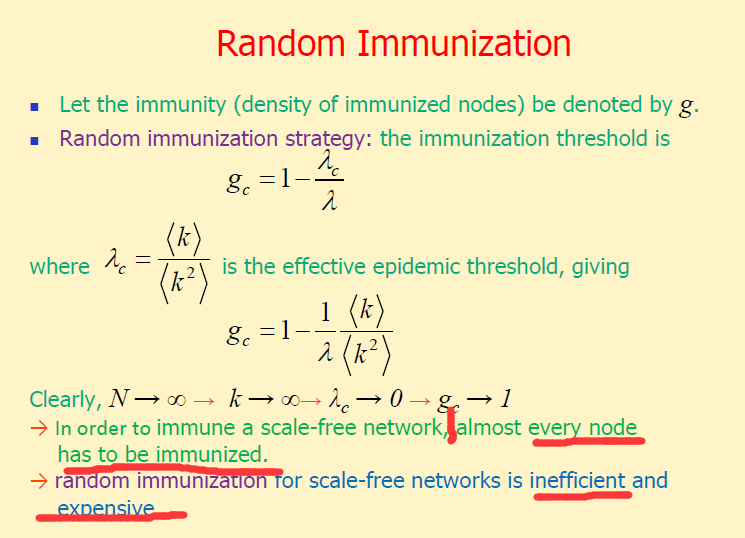

## Ch3 网络拓扑结构

### regular network

#### 特点：每个节点的度数一样

#### example: Full connected graph

### Random Graph Theory

#### 网络特点

1. 按照概率P生成边

2. 度服从泊松分布   

3. 小 avg path 和clustering coefficient

4. 每个节点大致拥有相同的边   平均来说

5. 不再增长

   

#### 网络属性计算

### small word networks

#### 网络特点

1. 度服从泊松分布   

2. 小 的avg path 和大的clustering coefficient

3. 每个节点大致拥有相同的边   平均来说

4. 不再增长

#### WS small network  

##### rewiring 算法

#### NW small network 

##### 特点：adding edges to network

#### scale-free network

##### BA scale-free network model 

特点：

1. 加点又加边
2. 度的分布是power-law 分布
3. 少数点拥有很多连接
4. **可增长！！！**

##### Extended BA Model  $适用于r≠3$的情形

1. 加点
2. re-wiring
3. 加边

##### Example  道路图 VS 飞机图

##### 鲁棒性与脆弱性

## Ch4 Internet

### Internet structure and software

###    不同层次的Internet 

#### AS level

#### Internet visualization

### network topology Generators 

### Internet Hierarchical Structures

##### Stub domain 和Transit domain 的区别

## Ch5 Epidemic Spreading

### Virus Spreading Threshold

### Scale-free 免疫策略

#### 随机免疫

#### 目标免疫

#### 熟人免疫

## Ch6 Cascading

级联failure :

## Ch7 Synchronization

synchronized example:useful or harmful

### 两大核心问题：怎么描述个体的动态行为，怎么描述耦合网络的同步动态行为

目前看不懂是什么意思....

### 常见耦合网络的同步性

#### 小世界增强同步性

### 网络拓扑特性与同步性的关系

Betweenness 和Synchronization明显负相关

### 提升网络同步性的做法

1. Perturbing the network structure

2. Modifying the coupling structure

