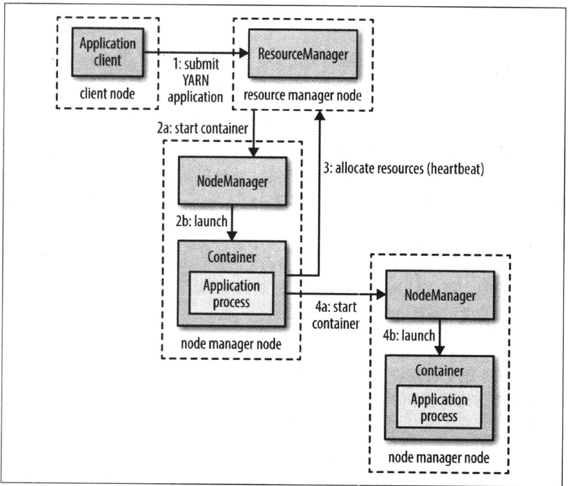
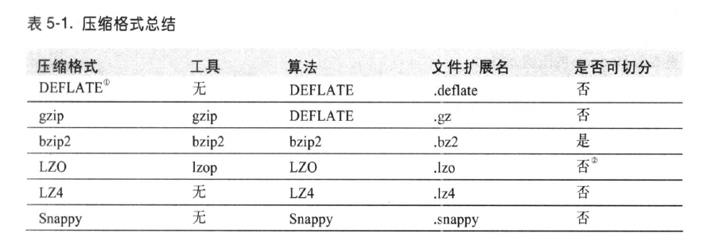

# hadoop权威指南笔记

[TOC]

## Ch4 YARN 

yarn的两类守护进程     resourcemanager  唯一  以及在所有节点上运行的启动和监控容器的nodemanager，容器用于执行特定应用程序的进程，有资源限制。  

### 疑问  yarn应用到底是个啥?

看做一种任务处理机制？mapreduce算是yarn应用的一种

## 

1. 资源请求

  YARN会在节点上申请容器，分配资源

Yarn的好处：

1. 可扩展性

jobtracker 与 tasktracker分离  支持更多节点一起工作

2. 可用性 

先为资源管理器提供高可用性再为application master提供高可用性

3. 利用率

  节点管理器管理的是资源池，而不是指定数量的slot,不再那么死板的管理资源

4. 多租户

   可以向除了mapreduce之外的分步式应用提供Hadoop服务

### Yarn中的调度

调度策略：FIFO  公平调度算法    容量调度算法

容量调度算法 default

分多个队列，队列内采用FIFO策略   ，对于资源有空闲的，采用弹性队列，通过限制最大容量占用来保证资源不会产生过度倾斜

公平调度器配置

不同队列所享受的资源相同

1. 队列配置   分配队列及其权重以及队列内的调度策略
2. 队列放置策略  决定应用应该放置到哪个队列
3. 抢占   为等待的应用队列抢占资源

- 延迟调度带来的得到容器的机会大大提升
- 面对多种资源的请求 ，使用DRF来寻找主导性资源，据此决定分配方式 

## Ch5  Hadoop I/O操作

### 5.1 数据完整性

根据校验和来检测数据是否损坏   CRC-32C

LocalFilesystem -> ChecksumFilesystem进行校验和检查

### 5.2 数据压缩

压缩的好处：

- 减少存储文件所需要的磁盘空间
- 加速传输速度

压缩和解压缩的JAVA例子 $P_{125}$

使用CodecPool 进行重复的压缩和解压缩操作

### 5.2.2 压缩和输入分片

在mapreduce中使用压缩基本是在中间过程  map  到 reducer的过程

### 5.3序列化

用处：用于进程间通信和永久存储

理想特性：紧凑、快速、可扩展、互操作（不同余元进行读写数据）

#### 5.3.1 hadoop 的Writable 接口

#### 5.3.2 writable 类

writable 类对所有JAVA基本类型提供封装，char类型除外。所有封装都包含get和set两个方法用于读取或存储封装的值

1. 整数类型

对于整数使用变长格式更有利于节省空间，因为大多数数值分布并不均匀，另外变长的VINTwritable和VlongWritable可以互相转换

2. Text类型     针对UTF-8的Writable类

### 5.4 基于文件的数据结构

1. SequenceFile 
2. MapFile    

