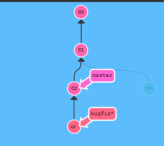
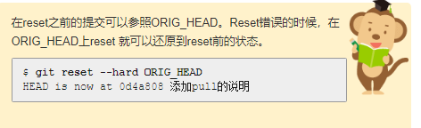
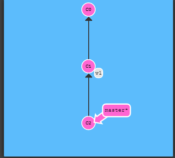
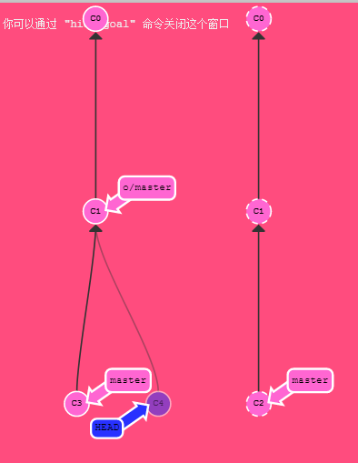
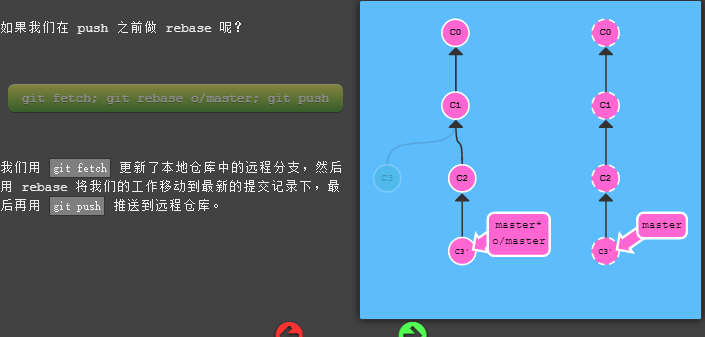

[TOC]


# git本地使用

### 

## 分支操作

### git branch

开发新的功能的时候使用分支

转换到分支上 使用

```git
git checkout branchname
git commit
```

### git merge 分支合并

将分支合并

在哪个分支执行git merge 就会merge另外一个分支然后在这个分支的下面创建一个新的提交记录

--suqash 将该分支上的所有提交合并为一个进行合并

### 分支删除 

```
git branch -d  branchname
```

### 分支合并冲突

### git rebase 分支合并

将另一个分支的提交记录复制到master的前面，看起来像是线性开发的



```
git rebase branch-name
git checkout master
git rebase branch-name
```


## 提交记录

### git log 查看提交记录

### git commit

提交对于文件的修改或者操作


### 改写提交

### git commit --amend 修改最近提交记录

会产生分离的HEAD

#### git cherry-pick   提取提交

合并其他分支到当前分支下来

#### git rebase -i 调整记录的位置或删除记录


### 撤销提交

#### 本地撤销  git reset   直接回滚几个记录

三种模式  ：soft hard mixed

误操作处理



#### 远程撤销  git revert 

向前提交一个记录 此记录撤销之前那些提交的内容

## 在提交树上移动 

### Head的作用

指向当前分支最近的提交记录

### 使用相对引用^来移动

```
git checkout HEAD^   向前移动一个版本
git checkout HEAD~4 向前移动四个版本

```

### 强制修改分支位置

```
git branch -f master HEAD~3
```

## 使用标签来特定指向某个提交 

```
git tag C1 v1
```



### git describe 

查看离HEAD最近的tag距离


# git 远程使用

## git clone 复制远程仓库内容

origin/master  与本地master的提交处于分离状态



## git fetch  从远程仓库获取数据

git fetch 会改变本地的远程分支，但不会改变Master

## git pull 抓取更新再合并到本地分支

其实是git merge和git fetch 的合并


## git push 




合并特性分支

