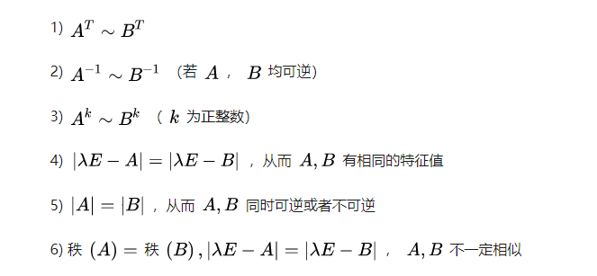

# 线性代数第五章 特征向量与特征值

[TOC]

## 5.1 特征向量与特征值

> A为n*n的矩阵，若存在λ使得$Ax=λx$有非平凡解x，则称λ为A的特征值，x为对应于λ的特征向量

本质上来说，特征向量就是在矩阵A这种线性变换下，不会偏离原来的向量方向，只是长度发生了变化。对应λ的x的集合加上零向量组成了一个特征空间。

> 定理：三角矩阵的特征值为对角线上的元素

当矩阵A有零特征值时，表明$Ax=0$有非平凡解，所以A的列是线性相关的，所以A是不可逆的。

> 特征向量之间是线性无关的

## 5.2 特征方程

### 特征方程与特征值

特征方程是关于如何求解特征值和特征向量的部分

特征值可以根据定义$(A-λI)x=0$ ，求出行列式为零的λ取值即为特征值

再根据相应的特征值进行带入，对增广矩阵进行变换化简，求出自由变量对应的向量，就可以求得对应的特征向量

## 5.3 矩阵相似对角化

### 5.3.1矩阵相似

定义：

> 设A和B都是nxn矩阵，如果存在可逆矩阵P，使得$P^{-1}AP=B$,则称A相似于B，这种变换叫做相似变换

> 定理：如果A与B相似，那么他们具有相同的特征多项式，从而有相同的特征值（和相同重数）

### 相似矩阵的性质

### 相似矩阵的本质

A是空间线性变换 P代表的是新的变换空间的基 ，通过$P^{-1}AP$得到的是线性变换A在新坐标系的变换效果

### 5.3.2矩阵对角化

右上一节的相似性可得$A=PBP^{-1}$,加入B为对角矩阵D，那么称A是可以对角化的，于是A分解为了可逆矩阵与对角矩阵的乘积。

> 对角化定理：nxn矩阵A可对角化的充要条件是A有n个线性无关的特征向量

其中P的列为A的特征向量，D中的对角元素为A的特征值，且特征值和特征向量一一对应。证明AP=PD这个过程可以看出来。

对角化A的步骤：

1. 求出A的特征值
2. 求出A的特征向量
3. 写出P
4. 写出D

矩阵可对角化：

1. 特征值都不同（没有重根），那么需要n个
2. 特征值有重根，那么需要特征值对应的特征向量的个数跟它的重根数相同

## 5.4 特征向量与线性变换

### 5.4.1 线性变换的矩阵

 设V为n维空间，W为m维空间，T是V到M的线性变换。B和C分别是V和W的基。

设X∈V，其中x=$r_1b_1+r_2b_2+...+r_nb_n$ 则有
$$
[x]_B=\left[ \begin{array}{c}

r_1\\

r_2\\r_3 \\
.. \\
r_n

 \end{array} 
\right ],
$$
因为T是线性的，所以也可以变为
$$
[T(x)]_C=r1[T(b1)]_C+...+rn[T(bn)]_C \\
令M=[[T(b1)]_C]\space [T(b2)]_C]\space..[T(bn)]_C] ]\\
因此[T(x)]_C=M[x]_B
$$
对于坐标向量X来说，T的作用相当于用矩阵M左乘X,而M是基坐标经过T变换后的用C的基表示的坐标组成的矩阵。参见P286面。

如果涉及到V->V变换 那么M矩阵叫做B-矩阵，写为$[T]_B$

> 对角矩阵表示：
>
> 设$A=PDP^{-1}$,其中D为对角矩阵，若$R^n的基B由P的列向量组成$那么D是变换x->Ax的B-矩阵

## 5.5 特征值的迭代估计

### 幂算法 计算最大特征值

条件：矩阵A严格对角占优（有一个特征值的绝对值大于其他任何一个特征值）

步骤：

1. 选择一个最大分量为1的初始向量$x_0$
2. 对k=0,1,2,...
   1. 计算A$x_k$
   2. 设$u_k$是其中绝对值最大的分量
   3. 计算$x_{k+1}=(1/u_k)Ax_k$
3. 最后$u_k$趋向于主特征值$x_k$趋向于对应的特征向量

### 逆幂法 计算所有特征值

需要知道特征值的大概估计值 然后迭代求精

