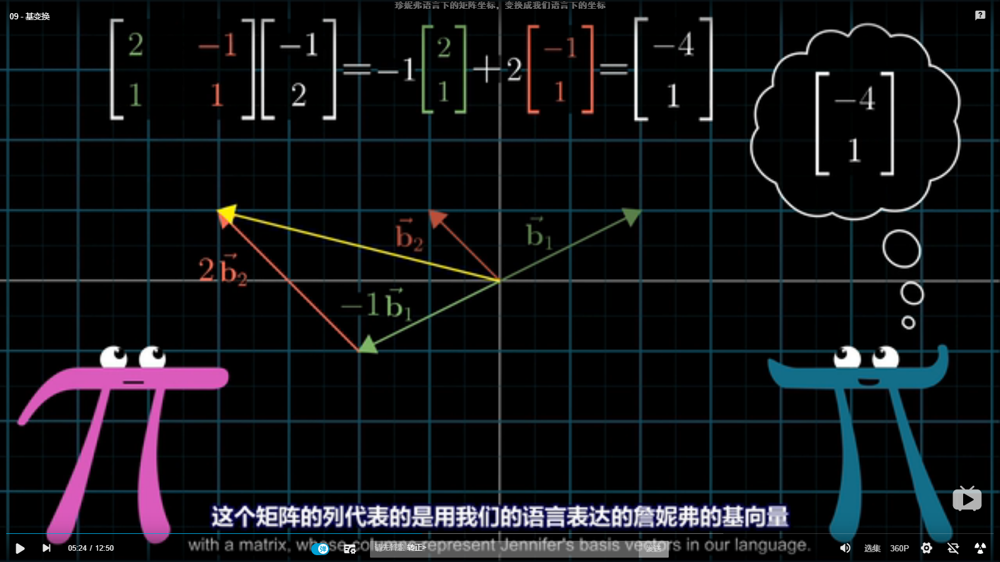

# 线性代数第四章 向量空间

[TOC]

## 4.1 向量空间与子空间

> 向量空间：一些被称为向量的对象构成的**非空**集合

向量空间的性质：

加法和标量乘法都是封闭的

子空间：向量空间V的子空间是满足三个性质的子集H：

> 1. V中的零向量在H中
> 2. H对向量加法封闭
> 3. H对标量乘法封闭

其实 子空间H就是V中的一些向量的$v_1,v_2,..,v_p$的全部线性组合的集合

表示为$span(v_1,v_2,...,v_p) $   

## 4.2  零空间、列空间和线性变换 

### 4.2.1 零空间 

#### 零空间的定义

> 零空间:所有满足方程组$Ax=0$的x的集合叫做矩阵A的零空间，记为$NulA$ 

更深入的来说 $Nul A$是将$R^n$中通过线性变换x->Ax映射到$R^m$中的零向量的全体向量x的集合

#### 零空间的求解方法

对矩阵A进行行变换为阶梯型，找出其中的自由变量，将主元列用自由变量表示，最后形成线性组合的形式。这些向量组成了一个**生成集**。

自由变量的个数＝生成集中向量的个数

零空间是隐式定义的

### 4.2.2 列空间

#### 列空间的定义

> mxn矩阵A的列空间（记为$colA$）是由A的列的所有线性组合组成的集合.若A=[$a_1,a_2,...,a_n$],则$colA=Span \{ a_1,a_2,..,a_n\}$

列空间是显示定义的

### 4.2.3 线性变换的核和值域

> 由向量空间V映射到向量空间W的线性变换T是一个规则，他将V中每个向量X映射成W中的唯一向量T（x）,且满足：
>
> 1. T（u+v）=T(u)+T(v)
> 2. T  (cu)=c*T(u)

线性变换的核为所有满足T（u）=0的向量u的集合，T的值域为W中所有具有形式T（x）（x∈V）的向量的集合.

## 4.3 线性无关集和基

线性无关的概念参照第二章

标准基的概念 组成基的向量的大小为1

生成集定理：

> 令$S=\{v_1,v_2,..,v_p\}$是V中的向量集，H=$span\{v_1,v_2,..v_p\}$.
>
> a. 若S中的一个向量可以被其他向量线性组合表示，则S中去掉v_k后形成的集合仍然可以生成H
>
> b. 若H不为空集，那么S的某一个子集是H的一个基

如何求零空间和列空间的基：

列空间：

这里给出一个定理：

> 矩阵的主元列构成列空间的一组基

将矩阵A化为行阶梯形B之后，B中哪些列是主元列，那么对应于A列中哪些列就是基中的向量。因为行变换不改变列的相关性，所以A与B具有相同的线性相关关系

零空间就是找自由变量，他们组成一组基

## 4.4 向量的坐标表示

> 唯一表示定理：向量在一个坐标系中只会有唯一一组坐标与之对应

### 4.4.1给定一组坐标系β的基，如何确定坐标？

将基按列拼在一起组成基矩阵B，设系数矩阵为C，向量在$R^n $中的坐标为X  。

其中

$$
C=\left[ \begin{array}{c}

c_1\\

c_2\\
c_3 \\
.. \\
c_n

 \end{array} 
\right ],
$$

那么解$B*C=X$这个方程就能解出系数矩阵C，即为在β坐标系下的坐标

当知道β坐标之后也能通过左乘B来得到在$R^n $中的坐标.

### 4.4.2 基变换

#### 非标准坐标系的直接转换

从一个坐标系中的基转换到另一个坐标系中的基，该如何进行变换？

如果知道其中一个基如何用另外一个基表示就很简单了

比如
$$
x=3b_1+b_2\\
b_1=4c_1+c_2\\
b2=-6c_1+c_2
$$
通过置换可以求出x用c1 c2 表示的式子，用矩阵表示就是技术

如果不知道两个基之间的转换关系，那么可以先求基之间的转换关系：

先列出增广矩阵

$[c_1 c_2 | b_1 b_2]$

这其实类似于AX=B ，我们需要寻找的就是B的基用C是如何表示的，然后利用置换就可以得到任意向量用基C表示的坐标

所以通过行化简将基C转换为标准基，得到$[I|P(B)]$

P(B)就是所求从B到C的基变换矩阵

#### 基变换的本质是什么？

找到一种线性映射，将一个坐标系的基用另一个坐标系的基线性表示，从而得到一个坐标系到另一个坐标系的坐标转换

两个坐标系都往标准坐标系转换

由于标准系的基为标准基，所以基坐标转换矩阵为对应坐标系的基所列成的矩阵，那么有

$P_B[x]_B=x=P_C[x]_c$

可以得到$[x]_c=P_C^{-1}P_B[x]_b$

线性代数本质中讲述的正是标准基与其他非标准基之间的坐标转换

## 4.5 向量空间的维度

> 若向量空间V具有一组包含n个向量的基，那么任何超过n个向量的集合一定线性相关

V的维数等于基中向量的个数->维数等于构建向量空间的线性无关向量的个数

> 有限维向量空间V的子空间H的维度小于等于V

零空间和列空间的维数之和等于列数

## 4.6 矩阵的秩

> 行空间：行向量的线性组合构成了A的行空间，记为Row A.

行空间可以看作A的转置的列空间$ColA^T$

> 如果矩阵A、B行等价，则它们的行空间相同，如果B为阶梯型，则B的非零行构成A的行空间的一个基也是B行空间的一个基

矩阵的秩就是矩阵列空间的维数

事实上Nul A和Row A是互相垂直的